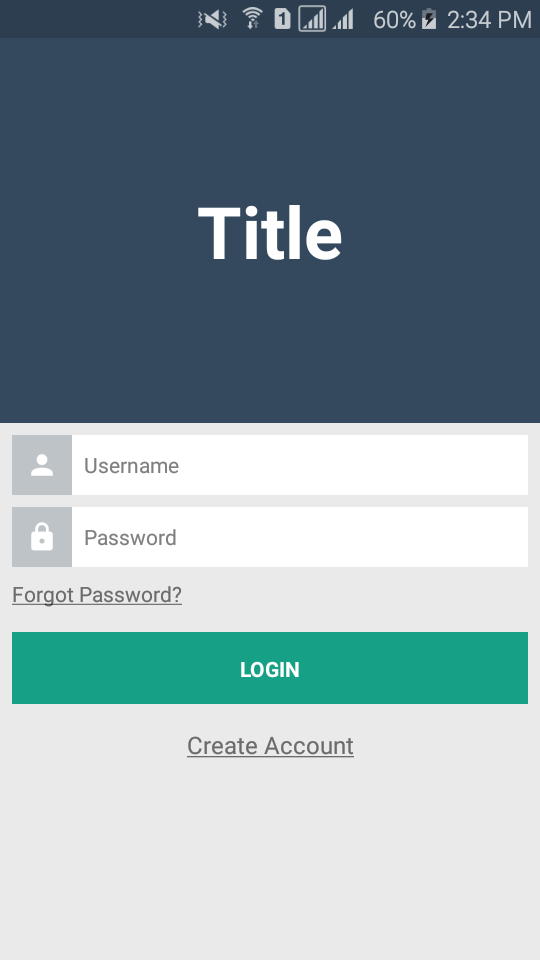

# React Native Login

#### *Login Template* for *React-Native* using *Redux Architecture*.

### Screenshots

### Packages
- **redux**
- **react-redux**
- **redux-thunk**
- **react-navigation**

## Installation
1. Initialize node modules with **npm install** or **yarn install**.
2. Create an instance of react-native packager by **react-native start**.
3. Make sure a device is connected.
4. Execute **react-native run-android** for android or **react-native run-ios** for iOS.
